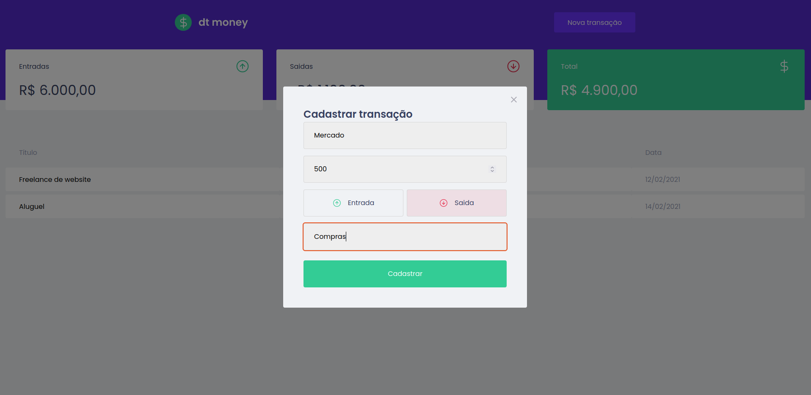
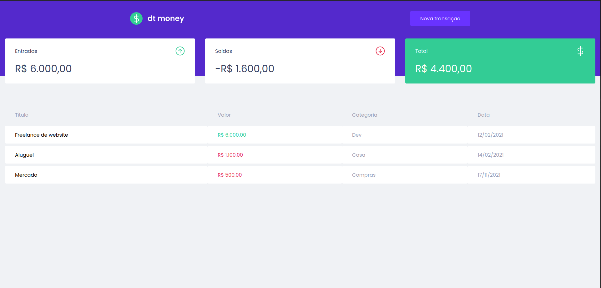

# dt money 
>dt money is an app that register withdraw and deposits transactions, calculate the total transaction in real time.

### 🧪 Technologies

- React 
- TypeScript
- MirageJS

### I used important concepts and tools from the React ecosystem like Styled Componnets, MirageJS, Context API, hooks, Axios, and more. 

-----------------------------------------------------------------
------------------------------

### Register products withdraw and deposits

-------------------
-------------------
### updating deposits and withdraw on the front end and the same time atualizing total value of deposits, withdraw and total net.

